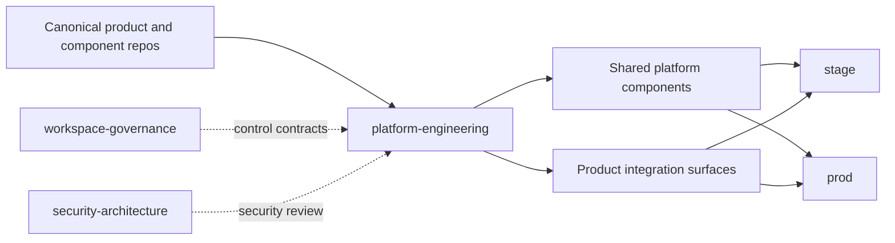

# platform-engineering

`platform-engineering` is the shared platform and release-governance repository
for the local multi-product stack.

OpenClaw is the most mature product currently integrated here, but it is only
one product. This repository should be understandable and reusable even when
more products are added later.

Security standards, trust-boundary review, and durable security evidence are
owned in `security-architecture/`, not duplicated here.

## Architecture At A Glance



This repo is where approved source and platform policy become declared runtime
shape. It is the release and environment authority, not the canonical home of
every product implementation.

Concrete security review references for this repo:

- [`security-architecture/docs/architecture/platform/trust-boundaries.md`](https://github.com/mfshaf7/security-architecture/blob/main/docs/architecture/platform/trust-boundaries.md)
- [`security-architecture/docs/architecture/domains/gitops-and-machine-trust.md`](https://github.com/mfshaf7/security-architecture/blob/main/docs/architecture/domains/gitops-and-machine-trust.md)
- [`security-architecture/docs/architecture/domains/secrets-and-recovery.md`](https://github.com/mfshaf7/security-architecture/blob/main/docs/architecture/domains/secrets-and-recovery.md)
- [`security-architecture/docs/standards/ai-security-and-governance.md`](https://github.com/mfshaf7/security-architecture/blob/main/docs/standards/ai-security-and-governance.md)
- [`security-architecture/docs/reviews/security-review-checklist.md`](https://github.com/mfshaf7/security-architecture/blob/main/docs/reviews/security-review-checklist.md)
- [`security-architecture/docs/reviews/platform/2026-04-18-platform-engineering-security-baseline.md`](https://github.com/mfshaf7/security-architecture/blob/main/docs/reviews/platform/2026-04-18-platform-engineering-security-baseline.md)
- [`security-architecture/docs/reviews/platform/2026-04-18-governed-ai-intake-assist-and-model-profiles.md`](https://github.com/mfshaf7/security-architecture/blob/main/docs/reviews/platform/2026-04-18-governed-ai-intake-assist-and-model-profiles.md)

## What This Repository Owns

This repository owns shared platform concerns:

- environment contracts
- approved source SHAs and image digests
- Argo-managed deployment state
- host provisioning for the WSL and Windows platform stack
- shared architecture, standards, and runbooks
- product integration contracts under `products/<product>/`

It does not own product source implementations such as Telegram behavior, host
bridge code, or upstream application code.

## Documentation Truth Model

Use the repo surfaces by truth type, not interchangeably:

- target architecture and steady-state design
  - `docs/architecture/overview.md`
  - shared standards and ADRs under `docs/standards/` and `docs/decisions/`
  - product runtime contracts under `products/<product>/runtime-contract.md`
- declared desired operating posture in Git
  - environment manifests under `environments/`
  - product lifecycle contracts such as
    `environments/prod/openclaw-lifecycle.yaml`
- observed live reality
  - `docs/architecture/current-platform-topology.md`
  - `docs/runbooks/access-platform-uis.md`

The live-truth documents should reflect what is actually deployed on their
validation date, even during rehearsals or temporary prod suspension. The
target and contract documents should describe the intended durable model.

## Platform Model

There are two layers in this repo:

1. shared platform layer
   - cluster bootstrap
   - Vault and secret-delivery patterns
   - Argo reconciliation
   - host provisioning
   - release governance
   - shared observability
2. product integration layer
   - runtime contract for each product
   - product dependencies
   - product visibility and operating checks
   - product-specific release and deployment notes

That split is implemented under:

- shared platform docs: `docs/`
- product integration docs: `products/<product>/`

## Current Product Set

- `products/openclaw/`
  - AI runtime and host-control product integration
- `products/openproject/`
  - internal project-management service integration
- `products/_template/`
  - template for future product onboarding

## Where To Start

### Shared platform

- [docs/README.md](docs/README.md)
- [docs/components/README.md](docs/components/README.md)
- [docs/decisions/adr/README.md](docs/decisions/adr/README.md)
- [docs/records/change-records/README.md](docs/records/change-records/README.md)
- [docs/architecture/overview.md](docs/architecture/overview.md)
- [docs/architecture/current-platform-topology.md](docs/architecture/current-platform-topology.md)
- [docs/workflows/README.md](docs/workflows/README.md)
- [docs/runbooks/access-platform-uis.md](docs/runbooks/access-platform-uis.md)
- [docs/runbooks/dev-integration-profiles.md](docs/runbooks/dev-integration-profiles.md)
- [docs/runbooks/assess-environment-readiness.md](docs/runbooks/assess-environment-readiness.md)
- [docs/runbooks/active-stack-runtime-drill.md](docs/runbooks/active-stack-runtime-drill.md)
- [docs/standards/README.md](docs/standards/README.md)
- [docs/standards/enterprise-workflow-model.md](docs/standards/enterprise-workflow-model.md)
- [docs/standards/dev-integration-lane.md](docs/standards/dev-integration-lane.md)
- [docs/standards/governed-ai-access-model.md](docs/standards/governed-ai-access-model.md)
- [docs/standards/review-and-approval-model.md](docs/standards/review-and-approval-model.md)
- [docs/standards/governed-change-model.md](docs/standards/governed-change-model.md)
- [docs/standards/product-boundaries.md](docs/standards/product-boundaries.md)
- [docs/standards/product-documentation-model.md](docs/standards/product-documentation-model.md)

### Product integrations

- [products/README.md](products/README.md)
- [products/openclaw/README.md](products/openclaw/README.md)
- [products/openproject/README.md](products/openproject/README.md)
- [products/openclaw/runbooks/access-openclaw.md](products/openclaw/runbooks/access-openclaw.md)
- [products/openproject/runbooks/access-openproject.md](products/openproject/runbooks/access-openproject.md)

## If You Need To Know What Exists Right Now

Start here in this order:

1. [docs/architecture/current-platform-topology.md](docs/architecture/current-platform-topology.md)
2. [docs/runbooks/access-platform-uis.md](docs/runbooks/access-platform-uis.md)
3. the relevant product access runbook under `products/<product>/runbooks/`

Those documents are meant to answer:

- what is deployed
- where it lives
- what is directly reachable
- how to log in
- what is intentionally internal-only or suspended

For enterprise workflow governance, also use:

- [docs/workflows/README.md](docs/workflows/README.md)
- [docs/standards/README.md](docs/standards/README.md)
- [docs/standards/enterprise-workflow-model.md](docs/standards/enterprise-workflow-model.md)
- [docs/standards/review-and-approval-model.md](docs/standards/review-and-approval-model.md)
- [.github/pull_request_template.md](.github/pull_request_template.md)

## Shared Component Map

For shared component architecture and operations, use:

- [docs/components/argo-cd/README.md](docs/components/argo-cd/README.md)
- [docs/components/vault/README.md](docs/components/vault/README.md)
- [docs/components/observability/README.md](docs/components/observability/README.md)
- [docs/components/external-secrets/README.md](docs/components/external-secrets/README.md)
- [docs/components/operator-orchestration-service/README.md](docs/components/operator-orchestration-service/README.md)
- [docs/components/platform-postgresql/README.md](docs/components/platform-postgresql/README.md)
- [docs/components/workspace-governance-control-fabric/README.md](docs/components/workspace-governance-control-fabric/README.md)
- [docs/components/context-governance-gateway/README.md](docs/components/context-governance-gateway/README.md)

## Operator Entrypoints

Top-level operator entrypoints exist in this repo, but they are not all
product-neutral.

- shared platform and provisioning commands:
  - `make provision-wsl-host`
  - `make provision-k3s-node`
  - `make provision-transit-vault-host`
  - `make devint-up PROFILE=<profile>`
  - `make devint-status PROFILE=<profile>`
  - `make devint-access PROFILE=<profile>`
  - `make devint-smoke PROFILE=<profile>`
  - `make devint-down PROFILE=<profile>`
  - `make devint-reset PROFILE=<profile>`
  - `make devint-promote-check PROFILE=<profile>`
  - `make platform-drill ACTION=<plan|snapshot|activate|verify|record|restore|status> PROFILE=active-stack-runtime-drill`
  - `make platform-drill ACTION=<plan|snapshot|activate|verify|record|restore|status> PROFILE=environment-complete-runtime-drill`
  - `make environment-readiness ACTION=<status|validate> ENVIRONMENT=<stage|prod>`
  - `make verify-platform-host`
  - `make verify-restart-survival`
  - `make render-windows-bootstrap`
  - `make validate`
- OpenClaw-specific release commands:
  - `make openclaw-gateway-prepull-image`
  - `make openclaw-gateway-tag`
  - `make openclaw-gateway-pin`
  - `make openclaw-gateway-validate`
  - `make openclaw-gateway-record`
  - `make openclaw-gateway-verification`
  - `make openclaw-gateway-promote`
  - `make openclaw-gateway-prod-verification`
  - `make openclaw-gateway-readiness`
  - `make openclaw-telegram-overlay-status`
  - `make openclaw-telegram-overlay-pin`
  - `make openclaw-telegram-overlay-validate`
  - `make openclaw-telegram-overlay-record`
  - `make openclaw-telegram-overlay-disable`
  - `make openclaw-prod-state`
  - `make openclaw-stage-state`
  - `make show-prod-versions`
  - `make show-stage-versions`
- OpenProject-specific commands:
  - `make openproject-apply`
  - `make openproject-status`
  - `make openproject-access`
  - `make openproject-sync-admin-password`
  - `make openproject-configure-idea-backlog`
  - `make openproject-configure-delivery-art`
  - `make openproject-sync-delivery-art-views`
  - `make openproject-check-delivery-art-quality`
  - `make openproject-standardize-delivery-art`
  - `make openproject-verify-clean-start`
  - `make openproject-provision-delivery-art-identities`
  - `make openproject-provision-operator-orchestration-identity`
  - `make openproject-provision-operator-orchestration-delivery-access`
  - `make openproject-uninstall`

OpenProject delivery execution is no longer exposed as a platform-local script
surface. Use the broker-owned operator surface in
[`operator-orchestration-service`](https://github.com/mfshaf7/operator-orchestration-service/blob/main/docs/operations/delivery-workflow-operator-surface.md)
for ART reads, mutations, review recording, completion, and proposal-to-
delivery transitions.

Historical Docker-to-`Platform-Core` migration helpers remain available only as
explicit `legacy-...` targets in the top-level `Makefile`. They are not part of
the current deployment surface.

See [scripts/README.md](scripts/README.md) for shared platform scripts, then use
the product-local script indexes:

- [products/openclaw/scripts/README.md](products/openclaw/scripts/README.md)
- [products/openproject/scripts/README.md](products/openproject/scripts/README.md)

`make validate` now includes the shared structure guard
`scripts/validate_repo_structure.py` so product-specific files cannot drift back
into shared `docs/runbooks/` or `scripts/` unnoticed. It also validates the
governance documentation, workflow docs, review surface, and the aggregate
stage/prod environment-readiness contracts in non-failing `status` mode.

`dev-integration` is the shared fast-iteration lane. It runs on local `k3s`,
allows local branch or worktree inputs without PRs, and requires a governed
handoff back into `stage` once the winning shape is ready.

Only `active` profiles are self-serve launchable there. Profile admission and
request state are tracked in `workspace-governance`, while this repo only owns
the shared runner and local-k3s lane mechanics.

The primary operator-facing procedure for requesting and using those profiles
is:

- [docs/runbooks/dev-integration-profiles.md](docs/runbooks/dev-integration-profiles.md)

The shared-vs-product structure contract for this repo lives in
[repo-structure-manifest.yaml](repo-structure-manifest.yaml), not only inside
the validator code.

## Repository Layout

```text
platform-engineering/
|-- .github/workflows/
|-- ansible/
|-- argocd/
|-- charts/
|-- docs/
|-- environments/
|-- observability/
|-- products/
|-- scripts/
`-- terraform/
```
