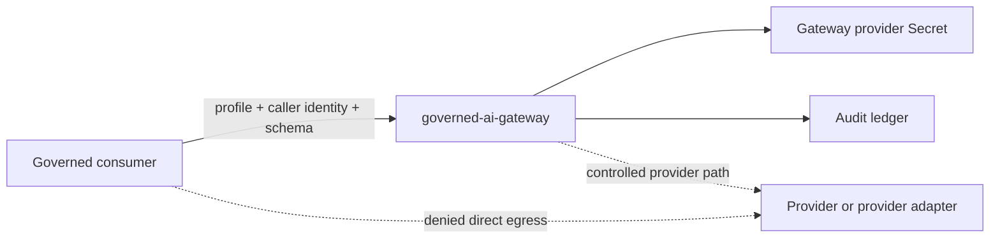

# Governed AI Gateway Architecture

## Role

The governed AI gateway is the platform access-plane implementation boundary
for bounded AI consumers. It accepts requests only from allowed callers,
checks the requested model profile and output schema, emits audit records, and
keeps provider credentials in gateway custody.

Consumers call the gateway. Consumers do not hold provider credentials and do
not call providers directly.

## Current Live Shape

Current allowed posture:

- local-k3s `dev-integration` runtime through profile `governed-ai-gateway`
- gateway API Deployment and Service in the profile namespace
- gateway-only Kubernetes Secret for provider credential custody
- PVC-backed local audit ledger
- consumer probe namespace with default-deny egress
- provider sentinel namespace used to prove direct-provider bypass denial

Current denied posture:

- no governed `stage` or `prod` Argo application
- no direct provider credentials in consumers
- no direct provider passthrough
- no autonomous workspace truth mutation
- no live `intake-classifier-v1` consumption until security and workspace
  activation gates are complete

## Model

The dev-integration runtime uses a provider sentinel instead of a real external
provider to prove the network and custody boundary without introducing a live
provider dependency before activation.

## Activation Gates

The gateway runtime alone is not enough to call model use governed. Live
activation still requires:

- active model profile with selected upstream model
- caller identity boundary
- operator identity when human approval is required
- audit retention evidence
- provider-egress denial evidence
- current security delta review
- workspace consumer activation contract

## Read With

- [../../standards/governed-ai-access-model.md](../../standards/governed-ai-access-model.md)
- [../../../security/governed-ai-access-plane.yaml](../../../security/governed-ai-access-plane.yaml)
- [../../../security/governed-ai-runtime-assist-contract.yaml](../../../security/governed-ai-runtime-assist-contract.yaml)
- [../../../security/governed-ai-devint-egress-policy.yaml](../../../security/governed-ai-devint-egress-policy.yaml)
