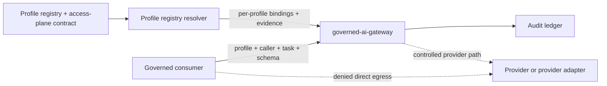

# Governed AI Gateway Architecture

## Role

The governed AI gateway is the platform access-plane implementation boundary
for bounded AI consumers. It accepts requests only from allowed callers,
checks the requested model profile and output schema, emits audit records, and
keeps provider credentials in gateway custody.

Consumers call the gateway. Consumers do not hold provider credentials and do
not call providers directly.

## Current Live Shape

Current allowed posture:

- local-k3s `dev-integration` runtime through profile `governed-ai-gateway`
- gateway API Deployment and Service in the profile namespace
- bounded Ollama adapter with pinned model digest and runtime version
- data-driven multi-profile resolver with deterministic per-profile binding
  evidence
- PVC-backed local audit ledger
- consumer probe namespace with default-deny egress
- provider sentinel namespace used to prove direct-provider bypass denial

Current denied posture:

- no governed `stage` or `prod` Argo application
- no direct provider credentials in consumers
- no direct provider passthrough
- no autonomous workspace truth mutation
- no workspace consumer use until its independent activation gate is complete

The active dev-integration binding is host Ollama `0.32.14` with
`qwen3:8b` pinned by full digest. The adapter disables thinking, supplies no
tools, enforces a strict classification schema, and bounds input size,
concurrency, timeout, retry, context, and output tokens. The OpenAI binding is
preserved as an inactive future route.

One runtime instance resolves the complete reviewed profile registry for one
environment. A request can select only an exact resolved profile and an allowed
task contract for its authenticated caller; it cannot discover profiles or
substitute tasks at request time. The resolver records each selected profile,
environment, binding, provider route, model identity, task schema, source
contract digests, and explicit `fail-closed-no-implicit-fallback` posture as a
deterministic evidence object. Pod readiness means that at least one profile is
independently eligible to serve; suspending one profile does not remove another
eligible profile from service. Readiness also exposes each profile state and the
legacy intake compatibility state separately. Invocation audits carry the
selected profile and task evidence.

## Model

The provider sentinel remains a negative bypass target. Positive proof uses the
real local Ollama route; the consumer namespace cannot reach either the
sentinel or Ollama directly.

`intake-classifier-v1` remains the active compatibility profile.
`delivery-work-design-advisor-v1` is selected but not active. The platform
gateway validates its typed request and strict output boundary, while OOS owns
the instruction text and all workflow or apply semantics.

## Activation Gates

The gateway runtime alone is not enough to call model use governed. Live
activation still requires:

- active model profile with selected upstream model
- independent access-plane activation approval; profile status alone cannot
  admit a request
- allowed provider route matching the selected model and profile
- caller identity boundary
- operator identity when human approval is required
- audit retention evidence
- provider-egress denial evidence
- current security delta review
- workspace consumer activation contract

## Read With

- [../../decisions/adr/ADR-021-multi-profile-governed-ai-gateway.md](../../decisions/adr/ADR-021-multi-profile-governed-ai-gateway.md)
- [../../standards/governed-ai-access-model.md](../../standards/governed-ai-access-model.md)
- [../../../security/governed-ai-access-plane.yaml](../../../security/governed-ai-access-plane.yaml)
- [../../../security/governed-ai-runtime-assist-contract.yaml](../../../security/governed-ai-runtime-assist-contract.yaml)
- [../../../security/governed-ai-devint-egress-policy.yaml](../../../security/governed-ai-devint-egress-policy.yaml)
