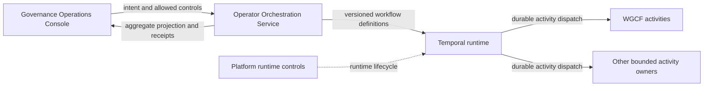

# Temporal Architecture

## Role

Temporal is a replaceable durable runtime behind
`operator-orchestration-service` (OOS). It provides scheduling, deterministic
workflow replay, persistent timers, and activity retry dispatch. It does not
decide business policy, approvals, admission, or completion truth.

## Authority Model

OOS owns:

- versioned workflow definitions
- orchestration request acceptance
- run-control API
- correlation and causation
- aggregate run projection
- final orchestration receipts

Temporal owns:

- durable scheduling
- deterministic replay
- timers and persisted waits
- activity retry dispatch

Activity owners retain their domain authority. For example, WGCF owns
governance validation and readiness activity behavior, while OOS retains the
aggregate workflow.

## Proposed Dev-Integration Shape

The first profile requests:

- local `k3s`
- one operator-scoped namespace
- Temporal service and diagnostic UI
- PostgreSQL-backed persistent workflow history
- OOS-owned workflow workers and clients connected through scoped identity
- read-only shared smoke checks

Normal `devint-down` must suspend runtime processes while preserving workflow
history. `devint-reset` is explicitly destructive and may remove only the
operator-scoped local profile state.

## Data Boundary

Temporal history is runtime state, not a new business source of truth.

Workflow payloads should carry:

- source record references and versions
- correlation and causation references
- bounded decisions and control signals
- receipt and artifact references

Workflow payloads must not carry:

- secret values
- raw operational context
- unbounded logs or artifacts
- duplicated business records that belong to an authority system

Retention, redaction, backup, restore, and visibility rules must be accepted
before runtime activation.

## Namespace And Task-Queue Boundary

- dev-integration namespaces are operator-scoped
- task queues must identify the owning workflow or activity boundary
- callers and workers must be authenticated before shared runtime admission
- one activity owner must not consume another owner's task queue accidentally
- direct Console credentials for Temporal are denied

Exact namespace, task-queue, ServiceAccount, and secret-delivery contracts are
implementation work after build admission.

## Current Runtime Posture

Allowed now:

- source-defined component and profile contracts
- architecture and security review
- proposed-profile status inspection after registry landing

Denied now:

- runtime installation
- persistent volume creation
- workflow execution
- self-serve access
- `stage` or `prod` deployment

## Read With

- [Operator Orchestration Service architecture](../operator-orchestration-service/architecture.md)
- [../workspace-governance-control-fabric/architecture.md](../workspace-governance-control-fabric/architecture.md)
- [../../runbooks/dev-integration-profiles.md](../../runbooks/dev-integration-profiles.md)
- [ADR-017](../../decisions/adr/ADR-017-temporal-durable-workflow-runtime.md)
