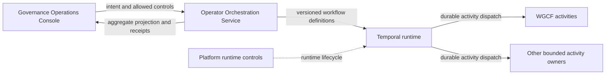

# Temporal Architecture

## Role

Temporal is a replaceable durable runtime behind
`operator-orchestration-service` (OOS). It provides scheduling, deterministic
workflow replay, persistent timers, and activity retry dispatch. It does not
decide business policy, approvals, admission, or completion truth.

## Authority Model

OOS owns:

- versioned workflow definitions
- orchestration request acceptance
- run-control API
- correlation and causation
- aggregate run projection
- final orchestration receipts

Temporal owns:

- durable scheduling
- deterministic replay
- timers and persisted waits
- activity retry dispatch

Activity owners retain their domain authority. For example, WGCF owns
governance validation and readiness activity behavior, while OOS retains the
aggregate workflow.

## Build-Admitted Dev-Integration Shape

The first profile requests:

- local `k3s`
- one operator-scoped namespace
- Temporal service and diagnostic UI
- PostgreSQL-backed persistent workflow history
- OOS-owned workflow workers and clients connected through scoped identity
- read-only shared smoke checks

Normal `devint-down` must suspend runtime processes while preserving workflow
history. `devint-reset` is explicitly destructive and may remove only the
operator-scoped local profile state.

## Data Boundary

Temporal history is runtime state, not a new business source of truth.

Workflow payloads should carry:

- source record references and versions
- correlation and causation references
- bounded decisions and control signals
- receipt and artifact references

Workflow payloads must not carry:

- secret values
- raw operational context
- unbounded logs or artifacts
- duplicated business records that belong to an authority system

Retention, redaction, backup, restore, and visibility rules must be accepted
before runtime activation.

## Namespace And Task-Queue Boundary

- dev-integration namespaces are operator-scoped
- task queues must identify the owning workflow or activity boundary
- activation-sensitive workflow queues derive a one-way generation from the
  accepted activation-manifest digest; same-manifest restarts reuse that
  generation, while a revoked digest is never admitted again
- callers and workers must be authenticated before shared runtime admission
- one activity owner must not consume another owner's task queue accidentally
- direct Console credentials for Temporal are denied
- PostgreSQL administration credentials are separate from the non-superuser
  Temporal application identity and are not projected into Temporal pods

NetworkPolicy restricts which admitted worker identities can reach the
frontend. It does not interpret task-queue names. Queue ownership therefore
also requires owner-specific worker registration, credentials, denial tests,
and fresh Security acceptance before activation.

## Generation Retirement Boundary

Activation revocation and clean generation retirement are different events.
Unexpected loss or replacement of activation evidence makes an ordinary OOS
worker fail-stop immediately. That protects the queue from continued polling,
but it does not prove outstanding executions were drained.

For planned suspension or replacement, Platform owns the ordered boundary:

1. quiesce OOS start ingress and prove zero active replicas and zero in-flight
   starts
2. scale ordinary OOS workflow pollers to zero and record that evidence
3. issue a digest-pinned retirement manifest for the old queue using drain
   observations no more than five minutes old and a lifetime no longer than
   fifteen minutes; the manifest also identifies the digest-derived generation
   start registry
4. allow OOS to seal that registry, reconcile and cancel its exact registered
   workflow IDs, and run one explicit one-shot worker on the retired business
   queue
5. verify the OOS receipt binds the registry seal to this retirement, accounts
   for every registration as matched or uncommitted, proves a terminal
   projection for every matched execution, and proves the one-shot worker
   started inside the manifest lifetime while both drain observations were no
   more than five minutes old
6. retain the receipt before issuing a fresh activation manifest and queue

Platform owns the manifest and receipt-acceptance boundary. OOS owns the
one-shot worker and receipt production. Temporal remains the runtime, not the
lifecycle authority. No separate lock service, coordination database, or
automatic cleanup claim is introduced.

Every admitted OOS business start writes its exact workflow ID to the durable
registry before attempting the business workflow start. Temporal Visibility is
retained for diagnostics, but eventual-consistency listing is not accepted as
retirement authority.

The source-defined namespace, task-queue, ServiceAccount, secret-reference,
payload, retention, and network contracts live under
`dev-integration/profiles/temporal/runtime/`. They remain subject to operating
proof and fresh Security acceptance before activation.

## Current Runtime Posture

Allowed now:

- source-defined and validated component, profile, persistence, identity,
  queue, payload, and operator contracts
- architecture and security review
- build-admitted status inspection
- generation-retirement manifest preparation and receipt verification against
  existing evidence

Denied now:

- runtime installation
- persistent volume creation
- workflow execution
- self-serve access
- `stage` or `prod` deployment

## Read With

- [Operator Orchestration Service architecture](../operator-orchestration-service/architecture.md)
- [../workspace-governance-control-fabric/architecture.md](../workspace-governance-control-fabric/architecture.md)
- [../../runbooks/dev-integration-profiles.md](../../runbooks/dev-integration-profiles.md)
- [ADR-017](../../decisions/adr/ADR-017-temporal-durable-workflow-runtime.md)
