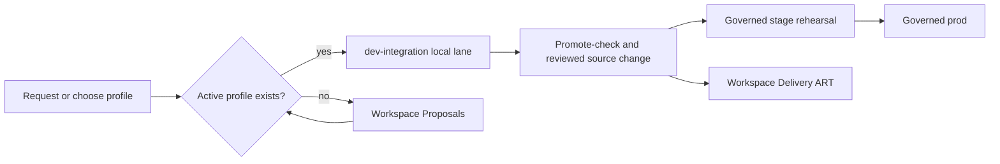

# Dev-Integration Profiles

This runbook is the primary operator-facing procedure for requesting and using
`dev-integration` profiles.

Use it when you need a fast local dev-integration environment for cross-repo
workflow or API iteration and want to know:

- whether an approved profile already exists
- how to launch and operate an approved profile
- how to request a new profile when no approved one fits

Do not reconstruct this flow from scattered contracts, templates, and
standards files. Those remain supporting governance sources, not the primary
operator path.

## Operator Lanes At A Glance



Read this as lane separation, not one blended environment:

- `dev-integration` is the fast local lane for changing workflow and API shape.
- `lane_class` declares the lane posture:
  - `prototype-devint` for prototype preview before graduation
  - `integration-devint` for workflow or API integration rehearsal
  - `governed-devint` for admitted governed component or workflow proof before
    stage handoff
- `Workspace Proposals` and `Workspace Delivery ART` remain the work-state
  systems of record while the local lane is active.
- `stage` is the first governed runtime rehearsal after reviewed source
  changes exist.
- `prod` comes only after the normal governed path, not from direct
  `dev-integration` promotion.

## 1. Check Whether An Active Profile Already Exists

The canonical registry is:

- [workspace-governance/contracts/developer-integration-profiles.yaml](https://github.com/mfshaf7/workspace-governance/blob/main/contracts/developer-integration-profiles.yaml)

Only profiles with:

- `lifecycle: active`

are self-serve launchable from the shared runner.

Current active profiles:

- `governance-control-fabric`
  - owner repo: `workspace-governance-control-fabric`
  - lane class: `governed-devint`
  - profile path:
    [workspace-governance-control-fabric/dev-integration/profiles/governance-control-fabric/profile.yaml](https://github.com/mfshaf7/workspace-governance-control-fabric/blob/main/dev-integration/profiles/governance-control-fabric/profile.yaml)
  - role: local-k3s API and PostgreSQL runtime access for Governance Operations Console and WGCF API contract iteration
- `idea-workflow`
  - owner repo: `operator-orchestration-service`
  - lane class: `integration-devint`
  - profile path:
    [operator-orchestration-service/dev-integration/profiles/idea-workflow/profile.yaml](https://github.com/mfshaf7/operator-orchestration-service/blob/main/dev-integration/profiles/idea-workflow/profile.yaml)
- `accepted-idea-delivery`
  - owner repo: `operator-orchestration-service`
  - lane class: `governed-devint`
  - profile path:
    [operator-orchestration-service/dev-integration/profiles/accepted-idea-delivery/profile.yaml](https://github.com/mfshaf7/operator-orchestration-service/blob/main/dev-integration/profiles/accepted-idea-delivery/profile.yaml)
  - role: persistent operator workbench for the local delivery ART lane
  - read-only smoke coverage: broker readiness, delivery draft validation,
    WGCF ART readiness configuration, optimized ART packet reads, and the first
    automated landing-unit closeout evidence read
- `accepted-idea-delivery-mutation-smoke`
  - owner repo: `operator-orchestration-service`
  - lane class: `integration-devint`
  - profile path:
    [operator-orchestration-service/dev-integration/profiles/accepted-idea-delivery-mutation-smoke/profile.yaml](https://github.com/mfshaf7/operator-orchestration-service/blob/main/dev-integration/profiles/accepted-idea-delivery-mutation-smoke/profile.yaml)
  - role: disposable mutating smoke companion for accepted-idea consume and backlink rehearsal

- `context-governance-gateway`
  - owner repo: `context-governance-gateway`
  - lane class: `governed-devint`
  - profile path:
    [context-governance-gateway/dev-integration/profiles/context-governance-gateway/profile.yaml](https://github.com/mfshaf7/context-governance-gateway/blob/main/dev-integration/profiles/context-governance-gateway/profile.yaml)
  - role: persistent local-k3s API, worker, PostgreSQL, MinIO, and PVC-backed
    custody lane for CGG service-mode context admission proof
- `governed-ai-gateway`
  - owner repo: `platform-engineering`
  - lane class: `governed-devint`
  - profile path:
    [platform-engineering/dev-integration/profiles/governed-ai-gateway/profile.yaml](https://github.com/mfshaf7/platform-engineering/blob/main/dev-integration/profiles/governed-ai-gateway/profile.yaml)
  - role: persistent local-k3s gateway API, provider-custody Secret, local
    audit ledger, consumer egress probe, and provider-sentinel denial proof for
    the governed AI access plane
  - launch rule: model-profile activation remains separately gated by the
    governed AI access-plane contract

If a suitable `active` profile already exists, use it directly. If not, follow
the request path in section 3.

Current build-admitted profile:

- `temporal`
  - owner repo: `platform-engineering`
  - lane class: `governed-devint`
  - request record: `openproject://work_packages/707`
  - profile path:
    [platform-engineering/dev-integration/profiles/temporal/profile.yaml](../../dev-integration/profiles/temporal/profile.yaml)
  - role: source-defined persistent local-k3s runtime adapter behind OOS for durable
    scheduling, replay, timers, waits, and activity retry dispatch
  - launch rule: source implementation is authorized, but self-serve launch,
    diagnostic access, backup, restore, and workflow execution remain denied
    until fresh Platform, Security, and workspace lifecycle gates make the
    profile `active`

### Temporal Generation Retirement

Temporal remains inactive, so there is no generation to retire now. Once the
profile is active and a prior OOS workflow generation exists, use the
Platform-owned procedure before suspension, replacement, or fresh activation:

1. quiesce OOS start ingress and prove zero active replicas and zero in-flight
   starts
2. prove zero ordinary OOS workflow pollers for both generated queues
3. issue the old generation manifest using observations no more than five
   minutes old and a lifetime no longer than fifteen minutes; the issuer derives
   both the business queue and durable start registry from the activation digest
   and pins the OOS Ed25519 receipt verifier
4. run the explicit OOS retirement command, which verifies its receipt key,
   seals the registry,
   reconciles and cancels exact registered workflow IDs, and starts the one-shot
   worker only after revalidating the manifest
5. verify the receipt signature, accounts for every registration, proves every matched run
   reached a terminal projection, and proves the one-shot worker started inside
   the manifest lifetime and within five minutes of both drain observations;
   retain it before issuing any fresh activation

The source-valid entrypoint is:

```bash
python3 dev-integration/profiles/temporal/scripts/generation_retirement.py --help
```

Use the exact command arguments and evidence rules in the
[Temporal profile procedure](../../dev-integration/profiles/temporal/README.md)
and the [Temporal operations guide](../components/temporal/operations.md).
Unexpected activation-evidence loss is an incomplete fail-stop fence; it is
never a substitute for this retirement procedure.

## 2. Use An Active Profile

Run the shared operator commands from `platform-engineering/`:

```bash
make devint-up PROFILE=<profile>
make devint-status PROFILE=<profile>
make devint-access PROFILE=<profile>
make devint-smoke PROFILE=<profile>
make devint-backup PROFILE=<profile>
make devint-restore PROFILE=<profile> BACKUP_FILE=<path> CONFIRM=<profile-confirmation>
make devint-promote-check PROFILE=<profile>
make devint-reset PROFILE=<profile>
make devint-down PROFILE=<profile>
```

Meaning:

- `devint-up`
  - creates, refreshes, or resumes the local profile runtime declared by the
    active profile
- `devint-status`
  - shows the current session and runtime state
- `devint-access`
  - holds open the profile's primary inspection surface, such as a local
    OpenProject UI port-forward, until you stop it
- `devint-smoke`
  - runs the profile’s smoke checks
  - for persistent ART profiles such as `accepted-idea-delivery`, this must
    stay read-only while still proving the optimized broker packet and closeout
    evidence surfaces that operators depend on
- `devint-backup`
  - captures an operator-local backup when a persistent profile implements the
    optional backup contract
- `devint-restore`
  - restores an operator-local backup only for profiles that implement the
    optional restore contract and only with the profile's explicit confirmation
    value
- `devint-promote-check`
  - renders the profile-owned governed handoff checklist that must be proven
    before calling the local slice ready for `stage`
- `devint-reset`
  - tears down and rebuilds the local profile state
- `devint-down`
  - stops the profile runtime using the profile's declared state model

State-model rule:

- `disposable` profiles
  - `devint-down` may remove the live runtime entirely
  - use `devint-reset` when you want a full local wipe including profile state
- `persistent` profiles
  - `devint-down` must preserve project data and behave as suspend
  - `devint-up` resumes or reconciles the preserved runtime
  - use `devint-reset` only when you intentionally want to destroy the local
    project history and rebuild from scratch
  - shared `devint-smoke` must stay read-only on the persistent working lane
  - backup and restore are profile-specific optional actions; they do not
    become available merely because a profile declares persistent state
  - if a workflow still needs mutating smoke, run that proof through a
    separate disposable companion profile instead

Important boundaries:

- `dev-integration` is local only
- it is not governed rollout evidence
- it must not write to governed `stage` or `prod` backends
- it may use local branches, worktrees, and dirty state
- it still requires a governed handoff before `stage`
- the active profile README and `stage_handoff.required_checks` are part of
  that handoff contract, not optional notes
- persistent profiles are reserved working lanes, not mutation-smoke targets
- if a test would create or mutate local work-tracking artifacts, it belongs in
  a disposable companion profile rather than the persistent lane
- a profile's runtime platform is declared in its owner-repo
  `profile.yaml`; active profiles can use local k3s or another approved local
  runtime shape, but the profile's access and smoke scripts are the authority
  for how operators reach it

Port-forward note for persistent OpenProject lanes:

- if the normal UI access session is already holding the profile's default
  OpenProject port, run smoke on an alternate local port while keeping the
  canonical host header, for example:
  - `DEVINT_OPENPROJECT_LOCAL_PORT=28183 DEVINT_OPENPROJECT_HOST_HEADER=localhost:18183 DEVINT_BROKER_LOCAL_PORT=28180 make devint-smoke PROFILE=accepted-idea-delivery`

## 3. Request A New Profile When None Fits

If no suitable `active` profile exists, request a new one.

The request/admission contract is generic, but the current human request
surface adapter is OpenProject.

Current request surface:

- project: `Workspace Proposals`
- identifier: `workspace-proposals`
- access path:
  [../../products/openproject/runbooks/access-openproject.md](../../products/openproject/runbooks/access-openproject.md)
- canonical backlog contract:
  [../../products/openproject/idea-backlog-contract.md](../../products/openproject/idea-backlog-contract.md)

Recommended request record shape in the current adapter:

- type:
  - `Component Proposal` when one component repo clearly owns the profile
  - otherwise the proposal type that best matches the owner shape
- status:
  - `captured` or `triaged` while the profile is still `proposed`

Required request content:

- requested profile id
- owner repo
- purpose
- requested runtime state model:
  - `disposable`
  - `persistent`
- participating repos
- runtime dependencies
- expected canonical backend writes, if any
- requested runtime platform, such as `local-k3s`
- whether identity, secrets, runtime privilege, or AI review is involved
- requested by
- request record system
- request record ref

Additional required request content for `persistent` profiles:

- why `persistent` is needed instead of a disposable smoke lane
- what data must survive normal `devint-down` / `devint-up` cycles
- what suspend/resume behavior operators expect
- expected storage size or storage-class constraints
- what `devint-reset` is allowed to destroy
- cutover plan when upgrading an existing disposable profile into a
  persistent project-backed lane
- smoke mutation mode
  - persistent profiles must keep shared `devint-smoke` read-only
- disposable companion profile, when the workflow still needs mutating smoke
  - do not point mutating smoke at the persistent working lane

Supporting template:

- [workspace-governance/templates/dev-integration-request/README.md](https://github.com/mfshaf7/workspace-governance/blob/main/templates/dev-integration-request/README.md)

When the current adapter is OpenProject, record:

- `request_record.system: openproject`
- `request_record.ref: openproject://work_packages/<id>`

## 4. How A Requested Profile Becomes Launchable

A request is not the same thing as an approved self-serve profile.

The admission path is:

1. the request is recorded
2. the owner repo confirms the profile belongs there
3. `platform-engineering` accepts or rejects the shared-lane fit
4. `security-architecture` reviews it when the profile widens identity,
   secrets, runtime privilege, AI influence, or other risky boundaries
5. `workspace-governance` records the profile in
   `developer-integration-profiles.yaml`
6. the profile may become `build-admitted` when implementation is authorized
   but runtime launch is still denied
7. the profile becomes self-serve only when its lifecycle is set to `active`

Persistent-profile acceptance rule:

- `platform-engineering` must explicitly accept the persistent runtime fit,
  storage model, and suspend/resume semantics
- `workspace-governance` should not mark a persistent profile `active` until
  the request record and owner docs make the destructive-reset boundary clear

Lifecycle meanings:

- `proposed`
  - request exists, not self-serve launchable
- `build-admitted`
  - implementation is authorized after platform and security gates, but the
    profile is not self-serve launchable
- `active`
  - admitted and self-serve launchable
- `suspended`
  - admitted before, temporarily blocked from normal launch
- `retired`
  - no longer part of the active self-serve set

## 5. What Happens After Dev-Integration

`dev-integration` never promotes its runtime directly into `stage`.

The required handoff is:

1. run `make devint-promote-check PROFILE=<profile>`
2. turn the winning local shape into real source changes
3. run repo-local validation
4. move those changes through the normal PR and platform contract path
5. rehearse the governed candidate in `stage`

Additional rule:

- do not treat source landing as workflow closure when the profile still
  requires governed `stage` rehearsal
- if the landed workflow surface changed, update the profile-owned
  `stage_handoff.required_checks`, the profile README `Stage Handoff Checks`
  section, and the promote-check output in the same work

For the workspace-level PR flow and Codex review procedure that begins after
step 4, use:

- [workspace-governance/docs/codex-github-review-and-automation.md](https://github.com/mfshaf7/workspace-governance/blob/main/docs/codex-github-review-and-automation.md)

Supporting standard:

- [../standards/dev-integration-lane.md](../standards/dev-integration-lane.md)
