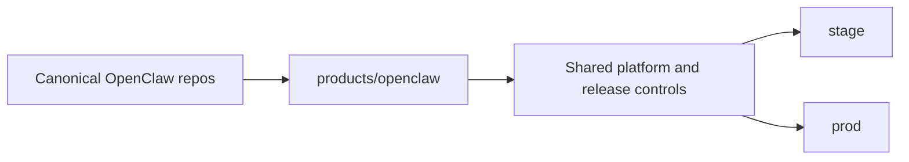

# OpenClaw Product Integration

This directory captures the platform-specific integration contract for OpenClaw.

It does not replace the canonical source repositories:

- `openclaw-telegram-enhanced`
- `openclaw-host-bridge`
- `openclaw-runtime-distribution`

Instead, it explains how OpenClaw uses the shared platform.

## Architecture At A Glance

This directory is the product-integration layer for OpenClaw. It connects the
canonical source repos to the shared platform runtime, release, and operator
model without becoming the source repo itself.

## What This Directory Covers

- OpenClaw runtime contract on the platform
- OpenClaw platform-side architecture and owner model
- product dependencies
- host integration shape
- product-scoped observability overlay assets
- product visibility and operating checks

## What It Does Not Cover

- Telegram source implementation details
- host bridge implementation details
- security standards
- generic platform bootstrap

Those remain in their owning repos or in shared platform docs.

## Current Product Reality

OpenClaw currently has the most mature governed rollout path in the workspace.
Its platform-specific scripts, runbooks, and operator guidance live under this
directory so the shared platform layer can stay product-neutral.

Today that maturity shows up as:

- stage candidate and rehearsal evidence are explicit Git-managed release
  objects
- the standardized stage readiness decision is explicit, but OpenClaw
  deliberately retains the product-local file name
  `environments/stage/promotion-readiness.yaml` because that same decision is
  the promotion gate for the approved stage candidate
- prod promotion reuses the approved stage digest instead of rebuilding
- post-promotion prod smoke or UAT is recorded separately from stage approval
- prod runtime now follows the shared governed lifecycle vocabulary:
  - `live`
  - `traffic-stopped`
  - `suspended`
  - `quarantined`
  so OpenClaw can be kept quiet, suspended, or incident-quarantined without
  tearing down unrelated prod services or hiding lifecycle behavior inside the
  Telegram channel layer

For small Telegram-only fixes, OpenClaw can also use a separate immutable
Telegram overlay artifact without rebuilding the full gateway image. That lane
is allowed only on top of a platform-qualified OpenClaw base, must be pinned by
digest, and may promote to prod only by reusing the exact approved stage
candidate on the same qualified base image.

## Start Here

- [AGENTS.md](AGENTS.md)
- [architecture-and-owner-model.md](architecture-and-owner-model.md)
- [runtime-contract.md](runtime-contract.md)
- [dependencies.md](dependencies.md)
- [host-integration.md](host-integration.md)
- [observability/README.md](observability/README.md)
- [runbooks/release-governance.md](runbooks/release-governance.md)
- [visibility-and-operations.md](visibility-and-operations.md)
- [runbooks/access-openclaw.md](runbooks/access-openclaw.md)
- [runbooks/host-stack-rollout.md](runbooks/host-stack-rollout.md)
- [runbooks/manage-prod-lifecycle.md](runbooks/manage-prod-lifecycle.md)
- [scripts/README.md](scripts/README.md)
- [skills-src/README.md](skills-src/README.md)
- [runbooks/README.md](runbooks/README.md)

For shared platform context, also see:

- [../../scripts/README.md](../../scripts/README.md)
- [../../docs/README.md](../../docs/README.md)
