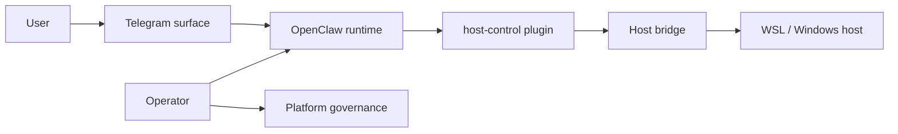

# OpenClaw Architecture And Owner Model

## Purpose

This document is the current platform-side architecture and owner model for
OpenClaw.

It replaces the old pattern where the isolated-model explanation lived in a
separate reference repo.

Use this document when you need to understand:

1. why OpenClaw is isolated from the daily-use operator environment
2. which components exist and why they are separate
3. where the current platform-side owner boundaries are
4. which repos hold the live implementation surfaces

## Problem Statement

Running an assistant directly on the same environment that stores user state,
operator tooling, and host control collapses too many responsibilities into one
place:

- assistant runtime
- user-facing chat surface
- host execution
- operator shell
- secrets and recovery state

The current model separates those responsibilities so the system is easier to
govern, review, recover, and promote safely.

## Top-Level Model

## Runtime Layers

### Product runtime layer

- OpenClaw runtime
- packaged Telegram runtime
- typed `host-control` tools

### Host enforcement layer

- `openclaw-host-bridge`
- `openclaw-host-recovery`
- host-local policy, audit, and staging

### Platform control layer

- source SHAs
- immutable image digests
- environment approval
- Argo reconciliation

## Why The Components Are Separate

### OpenClaw runtime

The runtime orchestrates sessions, routing, tools, and agent execution.

It should not become the host trust anchor.

### Telegram runtime

Telegram behavior belongs in its own owner repo because channel-specific
delivery, approvals, and routing do not belong in the host bridge or in shared
platform rollout logic.

### `host-control` tools

The product uses typed host-control tools instead of raw shell access.

That keeps product behavior explicit and reviewable while leaving host
enforcement outside the runtime.

### Host bridge

The host bridge is the enforcement point for:

- allowed roots
- permission classes
- audit
- export staging
- host-specific dispatch

### Platform governance

Build assembly, digest recording, environment approval, and promotion belong in
the platform repo because they are control-plane concerns, not product feature
concerns.

## Current Owner Map

| Owner | Current role |
| --- | --- |
| `openclaw-telegram-enhanced` | canonical Telegram behavior and Telegram-specific tests |
| `openclaw-host-bridge` | canonical host enforcement runtime, policy, audit, and attestation |
| `openclaw-runtime-distribution` | active stage/prod runtime composition and active `host-control-openclaw-plugin` package |
| `platform-engineering/products/openclaw` | platform-side product contract, architecture, runbooks, and release workflow |
| `security-architecture` | trust-boundary judgment, product security overlay, and cross-cutting security domains |

## Current Shape

- prod is the active governed environment
- stage is suspended by default and resumed deliberately for rehearsal
- prod bridge is always on
- stage bridge is on-demand and should stop again when stage is suspended
- current governed runtime assembly owner is `openclaw-runtime-distribution`

## What No Longer Exists

The platform no longer depends on a separate reference repo for:

- Telegram copied source trees
- bridge copied source trees
- local plugin code
- local gateway build wrappers
- workstation bootstrap guidance

Those old seams created drift and competed with the real owner repos.

## Related Docs

- [runtime-contract.md](runtime-contract.md)
- [dependencies.md](dependencies.md)
- [host-integration.md](host-integration.md)
- [visibility-and-operations.md](visibility-and-operations.md)
- [runbooks/README.md](runbooks/README.md)
- [../../../security-architecture/docs/architecture/products/openclaw/README.md](../../../security-architecture/docs/architecture/products/openclaw/README.md)
