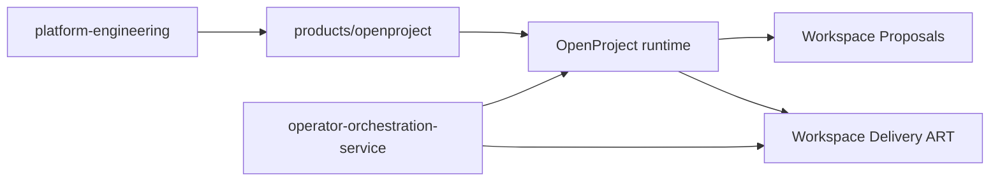
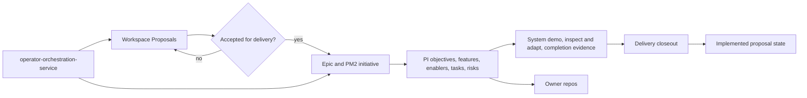

# OpenProject Product Integration

This directory captures the platform-specific integration contract for
OpenProject Community Edition on the local `k3s` cluster.

OpenProject is an internal supporting product on the shared platform. This
directory explains how it is declared, operated, and used as part of the
workspace workflow model.

## Architecture At A Glance

This directory is the OpenProject integration layer on the shared platform. It
connects the runtime, operator procedures, and workflow planes without claiming
that OpenProject has its own separate product-governed rollout train.

## What This Directory Covers

- runtime contract
- proposal backlog and delivery ART project contracts
- dependencies
- secrets and non-secret config expectations
- visibility and operating checks
- product-scoped runtime, bootstrap, and ART repair scripts and runbooks

## What It Does Not Cover

- upstream OpenProject source code
- generic platform bootstrap
- OpenClaw-specific host-control automation

## Current Product Shape

OpenProject is currently:

- deployed and reconciled by Argo CD
- packaged through the official upstream Helm chart
- backed by a standalone platform-managed PostgreSQL service plus local app
  storage
- exposed through the existing Windows localhost-friendly operator access model

## Current Workflow Maturity

OpenProject is currently `platform-integrated`.

In practice, that means the product has a real runtime, real operator
procedures, and a real workflow model on the shared platform, but it does not
yet have its own product-governed `source -> stage -> prod` lane with separate
rehearsal and promotion gates.

The highest implemented endpoint today is the platform-managed OpenProject
runtime on the local cluster plus its documented operator procedures.

OpenProject now also has governed release-state records for that exact
platform-owned contract. Those records fail closed when verification or
readiness evidence is missing, but they still do not create a separate
OpenProject-owned `source -> stage -> prod` rollout rail.

The delivery ART roadmap now treats OpenProject `version` as a derived
projection of canonical `Target PI`, with one explicit backlog bucket
`Not yet committed to a PI` and one retired-scope bucket `Retired scope`.
Those buckets keep the roadmap truthful, but they are not substitutes for PI
commitment on active non-`Epic` work.

The remaining OpenProject bootstrap and repair layer now also has one canonical
machine-readable boundary contract:

- [openproject-platform-admin-surface.json](openproject-platform-admin-surface.json)

The canonical planning path is now explicit as well:

- start with
  [runbooks/start-delivery-initiative.md](runbooks/start-delivery-initiative.md)
  when accepted work is first entering ART
- consume accepted work into one `Epic` shell
- frame the initiative while it stays backlog-shaped
- commit PI objectives and features during PI planning
- elaborate user stories only for committed features
- execute from child stories, defects, or tasks instead of umbrella shells
- review carryover and decommit work deliberately at PI boundaries

Initiative closeout is explicit too:

- record initiative-level `System Demo Evidence`
- move the initiative into PM² `Closing` only after the execution tree is clean
- record initiative-level `Inspect & Adapt Actions`
- mark the initiative `done` only from `Closing`
- use initiative `retired` as the separate non-success terminal path only after
  all descendants are already `done` or `retired`

Active blockers are explicit too:

- record the blocker on the affected work item as soon as the exact next
  committed step cannot proceed
- do not use generic create, update, or planning-repair to enter or clear
  `blocked`
- open a real `Defect` when the blocker is caused by a live system or workflow
  control bug
- open a `Risk` when the exposure is broader than one blocked item

The canonical OpenProject workflow model now has two distinct planes:

- [Workspace Proposals](idea-backlog-contract.md) for intake and proposal
  triage
- [Workspace Delivery ART](delivery-art-contract.md) for accepted work that
  moves into tracked delivery

Both remain OpenProject data planes on the shared platform. The supported
operator execution surface for `Workspace Delivery ART` is now broker-owned in
[`operator-orchestration-service`](https://github.com/mfshaf7/operator-orchestration-service/blob/main/docs/operations/delivery-workflow-operator-surface.md),
not in this product directory.

## ART Lifecycle At A Glance

Read this as the OpenProject workflow lifecycle:

- `Workspace Proposals` is the intake and proposal-triage plane.
- accepted work becomes a top-level `Epic` in `Workspace Delivery ART`.
- execution happens below that initiative through PI objectives and work-item
  hierarchy.
- completion is not just status change; it also requires evidence and closeout.
- owner repos still hold implementation truth while OpenProject holds
  work-state truth.

## Delivery Work-State Truth

When a serious initiative is already running inside `Workspace Delivery ART`,
start from the ART before doing repo work.

Truth split:

- [Workspace Delivery ART](delivery-art-contract.md) = work-state truth
- owner repos = implementation and design truth
- [`workspace-governance`](https://github.com/mfshaf7/workspace-governance/blob/main/README.md)
  = workspace-control truth

In practice:

- open the active initiative summary first
- treat chat and handoff notes as context, not as the official work queue
- reconcile meaningful uncovered work into the ART or route it to the correct
  alternate system of record

Out-of-coverage routing:

- same initiative: add a new `Feature` or `Task` under the active `Epic`
- new initiative: route through [Workspace Proposals](idea-backlog-contract.md)
- repeated process or control miss: route to
  [`workspace-governance/reviews/improvement-candidates/`](https://github.com/mfshaf7/workspace-governance/tree/main/reviews/improvement-candidates)
- security or trust-boundary judgment: route through
  [`security-architecture`](https://github.com/mfshaf7/security-architecture/blob/main/README.md)
  and reflect any blocking impact in the ART
- pure owner-repo maintenance outside the initiative: track it in the owner
  repo only

Inside `Workspace Delivery ART`, the current operator model is PM²-governed at
the initiative layer and SAFe-aligned at the execution layer. That includes:

- PI versions
- a derived roadmap bucket for work not yet committed to a PI
- `PI Objective`, `Feature`, `User story`, `Defect`, `Task`, `Milestone`, and
  `Risk` structural work-item types
- `Execution Classification` on `Feature` and `User story` for:
  - `Business`
  - `Enabler`
  - `Improvement`
- PI-objective business-value tracking
- WSJF prioritization fields
- ROAM risk tracking
- team and iteration planning summaries
- explicit system-demo and inspect-and-adapt recording workflows
- completion-evidence-backed execution and closeout workflows

## Start Here

- [AGENTS.md](AGENTS.md)
- [runtime-contract.md](runtime-contract.md)
- [runbooks/release-governance.md](runbooks/release-governance.md)
- [idea-backlog-contract.md](idea-backlog-contract.md)
- [delivery-art-contract.md](delivery-art-contract.md)
- [dependencies.md](dependencies.md)
- [secrets-and-config.md](secrets-and-config.md)
- [visibility-and-operations.md](visibility-and-operations.md)
- [runbooks/access-openproject.md](runbooks/access-openproject.md)
- [runbooks/check-delivery-art-workflow-health.md](runbooks/check-delivery-art-workflow-health.md)
- [runbooks/check-delivery-art-quality.md](runbooks/check-delivery-art-quality.md)
- [runbooks/start-delivery-initiative.md](runbooks/start-delivery-initiative.md)
- [runbooks/manage-delivery-initiative-lineage.md](runbooks/manage-delivery-initiative-lineage.md)
- [runbooks/manage-delivery-blockers.md](runbooks/manage-delivery-blockers.md)
- [openproject-platform-admin-surface.json](openproject-platform-admin-surface.json)
- [runbooks/openproject-platform-admin-surface.md](runbooks/openproject-platform-admin-surface.md)
- [runbooks/start-delivery-initiative.md](runbooks/start-delivery-initiative.md)
- [runbooks/plan-delivery-art.md](runbooks/plan-delivery-art.md)
- [runbooks/review-delivery-initiative.md](runbooks/review-delivery-initiative.md)
- [runbooks/sync-delivery-art-views.md](runbooks/sync-delivery-art-views.md)
- [runbooks/provision-delivery-art-identities.md](runbooks/provision-delivery-art-identities.md)
- [operator-orchestration-service delivery operator surface](https://github.com/mfshaf7/operator-orchestration-service/blob/main/docs/operations/delivery-workflow-operator-surface.md)
- [runbooks/prepare-production-clean-start.md](runbooks/prepare-production-clean-start.md)
- [scripts/README.md](scripts/README.md)
- [runbooks/README.md](runbooks/README.md)

Product-specific operational procedures such as backup and restore also live
under `runbooks/` and should not be added back to shared platform runbooks.
