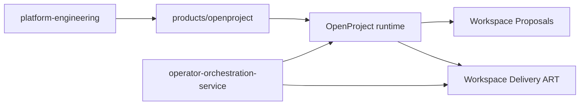

# OpenProject Product Integration

This directory captures the platform-specific integration contract for
OpenProject Community Edition on the local `k3s` cluster.

OpenProject is an internal supporting product on the shared platform. This
directory explains how it is declared, operated, and used as part of the
workspace workflow model.

## Architecture At A Glance

This directory is the OpenProject integration layer on the shared platform. It
connects the runtime, operator procedures, and workflow planes without claiming
that OpenProject has its own separate product-governed rollout train.

## What This Directory Covers

- runtime contract
- proposal backlog and delivery ART project contracts
- dependencies
- secrets and non-secret config expectations
- visibility and operating checks
- product-scoped operator scripts and runbooks for the OpenProject workflow
  model

## What It Does Not Cover

- upstream OpenProject source code
- generic platform bootstrap
- OpenClaw-specific host-control automation

## Current Product Shape

OpenProject is currently:

- deployed and reconciled by Argo CD
- packaged through the official upstream Helm chart
- backed by a standalone platform-managed PostgreSQL service plus local app
  storage
- exposed through the existing Windows localhost-friendly operator access model

## Current Workflow Maturity

OpenProject is currently `platform-integrated`.

In practice, that means the product has a real runtime, real operator
procedures, and a real workflow model on the shared platform, but it does not
yet have its own product-governed `source -> stage -> prod` lane with separate
rehearsal and promotion gates.

The highest implemented endpoint today is the platform-managed OpenProject
runtime on the local cluster plus its documented operator procedures.

The canonical OpenProject workflow model now has two distinct planes:

- [Workspace Proposals](idea-backlog-contract.md) for intake and proposal
  triage
- [Workspace Delivery ART](delivery-art-contract.md) for accepted work that
  moves into tracked delivery

Both remain platform-managed operator flows inside this product directory. They
do not imply a separate rollout lane.

## Delivery Work-State Truth

When a serious initiative is already running inside `Workspace Delivery ART`,
start from the ART before doing repo work.

Truth split:

- [Workspace Delivery ART](delivery-art-contract.md) = work-state truth
- owner repos = implementation and design truth
- [`workspace-governance`](https://github.com/mfshaf7/workspace-governance/blob/main/README.md)
  = workspace-control truth

In practice:

- open the active initiative summary first
- treat chat and handoff notes as context, not as the official work queue
- reconcile meaningful uncovered work into the ART or route it to the correct
  alternate system of record

Out-of-coverage routing:

- same initiative: add a new `Feature` or `Task` under the active `Epic`
- new initiative: route through [Workspace Proposals](idea-backlog-contract.md)
- repeated process or control miss: route to
  [`workspace-governance/reviews/improvement-candidates/`](https://github.com/mfshaf7/workspace-governance/tree/main/reviews/improvement-candidates)
- security or trust-boundary judgment: route through
  [`security-architecture`](https://github.com/mfshaf7/security-architecture/blob/main/README.md)
  and reflect any blocking impact in the ART
- pure owner-repo maintenance outside the initiative: track it in the owner
  repo only

Inside `Workspace Delivery ART`, the current operator model is PM²-governed at
the initiative layer and SAFe-aligned at the execution layer. That includes:

- PI versions
- `PI Objective`, `Feature`, `Enabler`, `User story`, `Task`, `Milestone`, and
  `Risk` work-item types
- PI-objective business-value tracking
- WSJF prioritization fields
- ROAM risk tracking
- team and iteration planning summaries
- explicit system-demo and inspect-and-adapt recording workflows
- completion-evidence-backed execution and closeout workflows

## Start Here

- [AGENTS.md](AGENTS.md)
- [runtime-contract.md](runtime-contract.md)
- [idea-backlog-contract.md](idea-backlog-contract.md)
- [delivery-art-contract.md](delivery-art-contract.md)
- [dependencies.md](dependencies.md)
- [secrets-and-config.md](secrets-and-config.md)
- [visibility-and-operations.md](visibility-and-operations.md)
- [runbooks/access-openproject.md](runbooks/access-openproject.md)
- [runbooks/show-delivery-initiatives.md](runbooks/show-delivery-initiatives.md)
- [runbooks/show-delivery-active-front.md](runbooks/show-delivery-active-front.md)
- [runbooks/check-delivery-art-quality.md](runbooks/check-delivery-art-quality.md)
- [runbooks/manage-proposal-to-delivery.md](runbooks/manage-proposal-to-delivery.md)
- [runbooks/start-delivery-execution.md](runbooks/start-delivery-execution.md)
- [runbooks/create-delivery-work-item.md](runbooks/create-delivery-work-item.md)
- [runbooks/bulk-update-delivery-work-items.md](runbooks/bulk-update-delivery-work-items.md)
- [runbooks/move-delivery-work-item.md](runbooks/move-delivery-work-item.md)
- [runbooks/update-delivery-work-item.md](runbooks/update-delivery-work-item.md)
- [runbooks/complete-delivery-work-item.md](runbooks/complete-delivery-work-item.md)
- [runbooks/manage-delivery-dependency.md](runbooks/manage-delivery-dependency.md)
- [runbooks/show-delivery-execution.md](runbooks/show-delivery-execution.md)
- [runbooks/show-delivery-planning.md](runbooks/show-delivery-planning.md)
- [runbooks/show-pi-objectives.md](runbooks/show-pi-objectives.md)
- [runbooks/record-pi-review.md](runbooks/record-pi-review.md)
- [runbooks/check-delivery-closeout-readiness.md](runbooks/check-delivery-closeout-readiness.md)
- [runbooks/close-delivery-initiative.md](runbooks/close-delivery-initiative.md)
- [runbooks/sync-delivery-art-views.md](runbooks/sync-delivery-art-views.md)
- [runbooks/update-delivery-initiative.md](runbooks/update-delivery-initiative.md)
- [runbooks/record-system-demo.md](runbooks/record-system-demo.md)
- [runbooks/record-inspect-and-adapt.md](runbooks/record-inspect-and-adapt.md)
- [runbooks/manage-delivery-blocker.md](runbooks/manage-delivery-blocker.md)
- [runbooks/manage-delivery-parking.md](runbooks/manage-delivery-parking.md)
- [runbooks/prepare-production-clean-start.md](runbooks/prepare-production-clean-start.md)
- [scripts/README.md](scripts/README.md)
- [runbooks/README.md](runbooks/README.md)

Product-specific operational procedures such as backup and restore also live
under `runbooks/` and should not be added back to shared platform runbooks.
