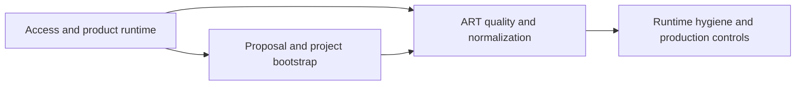

# OpenProject Runbooks

This directory contains OpenProject-specific platform runbooks.

These runbooks describe the OpenProject product integration on the platform.
They are not shared platform procedures.

Within `Workspace Delivery ART`, this runbook set now covers only the
OpenProject product runtime, bootstrap, and ART repair layer. The supported
delivery execution surface moved to
[`operator-orchestration-service`](https://github.com/mfshaf7/operator-orchestration-service/blob/main/docs/operations/delivery-workflow-operator-surface.md).

## Runbook Lanes At A Glance

Read this as operator workflow families:

- `access-openproject.md` gets you to the product and admin surface.
- `release-governance.md` defines how the current platform-owned OpenProject
  contract records candidate, verification, readiness, and prod verification
  state.
- `configure-idea-backlog.md` and `configure-delivery-art.md` live on the
  proposal and project-bootstrap side.
- `start-delivery-initiative.md` is the primary start-here operator surface
  for accepted work entering ART.
- `plan-delivery-art.md` is the detailed planning checklist and gate matrix for
  consume, framing, PI planning, rolling-wave elaboration, and PI carryover
  discipline.
- `manage-delivery-initiative-lineage.md` is the primary operator surface for
  top-level initiative family, anchor, and upstream lineage classification.
- `check-delivery-art-workflow-health.md` is the first ART-lane health read
  and the supported normal-session starting point before scoped quality or
  platform-admin repair.
- `provision-delivery-art-identities.md` is the control that converges the
  assignable repo-owner principals for `Workspace Delivery ART`.
- `check-delivery-art-quality.md` is the Platform compatibility adapter for
  scoped OOS quality and unscoped workflow-health projections.
- `manage-delivery-blockers.md` is the primary blocker trigger, recording, and
  clear checklist for active ART work.
- `openproject-platform-admin-surface.md` defines the remaining OpenProject
  platform-admin controls that are still allowed to use Rails-backed internals.
  The machine-readable source for that boundary is
  `../openproject-platform-admin-surface.json`.
- `standardize-delivery-art.md` is the controlled repair path when the ART
  needs one governed normalization pass after the contract changed.
- backup, uninstall, identity provisioning, and clean-start guidance remain
  runtime and hygiene controls around the workflow model.

## Runbooks

- [access-openproject.md](access-openproject.md)
- [release-governance.md](release-governance.md)
- [bootstrap-openproject.md](bootstrap-openproject.md)
- [configure-idea-backlog.md](configure-idea-backlog.md)
- [configure-delivery-art.md](configure-delivery-art.md)
- [start-delivery-initiative.md](start-delivery-initiative.md)
- [plan-delivery-art.md](plan-delivery-art.md)
- [manage-delivery-initiative-lineage.md](manage-delivery-initiative-lineage.md)
- [check-delivery-art-workflow-health.md](check-delivery-art-workflow-health.md)
- [sync-delivery-art-views.md](sync-delivery-art-views.md)
- [provision-delivery-art-identities.md](provision-delivery-art-identities.md)
- [check-delivery-art-quality.md](check-delivery-art-quality.md)
- [manage-delivery-blockers.md](manage-delivery-blockers.md)
- [../openproject-platform-admin-surface.json](../openproject-platform-admin-surface.json)
- [openproject-platform-admin-surface.md](openproject-platform-admin-surface.md)
- [standardize-delivery-art.md](standardize-delivery-art.md)
- [prepare-production-clean-start.md](prepare-production-clean-start.md)
- [provision-operator-orchestration-identity.md](provision-operator-orchestration-identity.md)
- [openproject-backup-restore.md](openproject-backup-restore.md)
- [uninstall-openproject.md](uninstall-openproject.md)

Delivery execution reads and writes now live in
[`operator-orchestration-service`](https://github.com/mfshaf7/operator-orchestration-service/blob/main/docs/operations/delivery-workflow-operator-surface.md).
